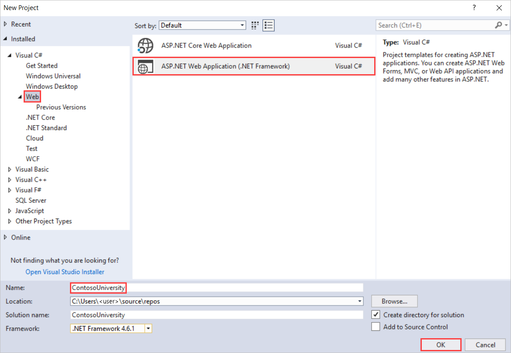
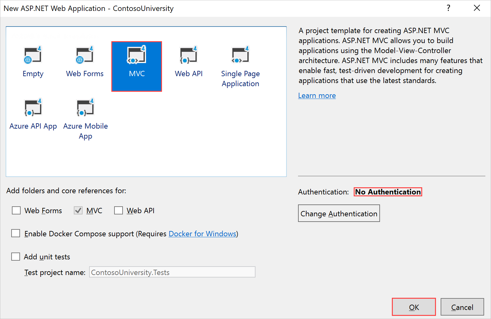
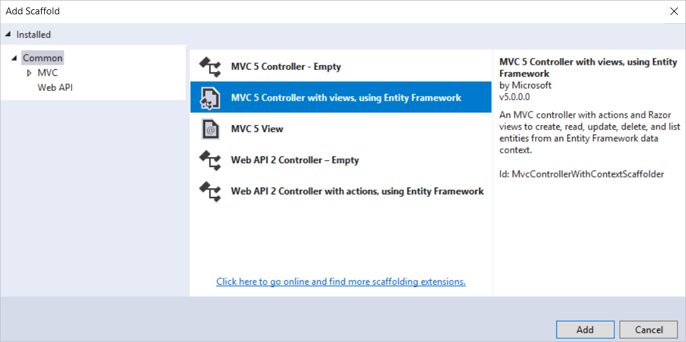
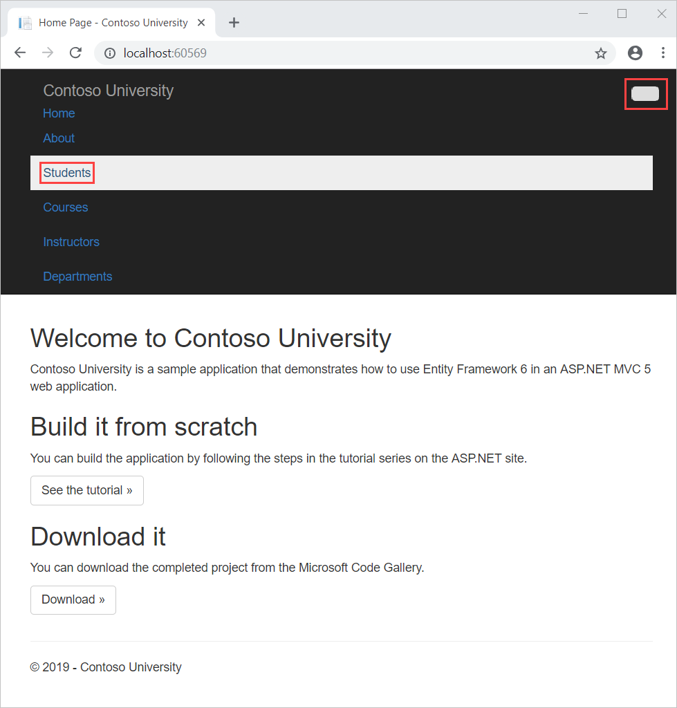

# با روش Entity Framework 6 Code First با استفاده از MVC 5


**نکته**

برای توسعه جدید، ASP.NET Core Razor Pages را به کنترلرها  و view های ASP.NET MVC توصیه می کنیم. برای یک سری آموزش مشابه با استفاده از Razor Pages، به Tutorial: Get start with Razor Pages in ASP.NET Core مراجعه کنید. آموزش جدید:

- دنبال کردنش راحت تره
- از پرس و جوهای کارآمدتر استفاده می کند.
- با آخرین API به روزتر است.
- ویژگی های بیشتری را پوشش می دهد.
- رویکرد ارجح برای توسعه اپلیکیشن جدید است.


در این سری از آموزش ها، یاد می گیرید که چگونه یک برنامه ASP.NET MVC 5 بسازید که از Entity Framework 6 برای دسترسی به داده ها استفاده می کند. این آموزش از گردش کار Code First استفاده می کند. برای اطلاعات در مورد نحوه انتخاب بین Code First، Database First، و Model First، به  [ایجاد مدل](https://learn.microsoft.com/en-us/ef/ef6/modeling/) مراجعه کنید.


این مجموعه آموزشی نحوه ساختن اپلیکیشن نمونه دانشگاه Contoso را توضیح می دهد. نمونه اپلیکیشن یک وب سایت ساده دانشگاهی است. با آن می توانید اطلاعات دانش آموز، دوره و مدرس را مشاهده و به روز کنید.

در این آموزش شما:

- یک برنامه وب MVC ایجاد میکنید
- استایل سایت را تنظیم میکنید
- فریموورک Entity Framework 6 را نصب میکنید
- مدل داده را ایجاد میکنید
- کتنتکست دیتابیس را ایجاد میکنید
- DB را با داده های آزمایشی مقداردهی اولیه میکنید
- فریموورک EF 6 را برای استفاده از LocalDB تنظیم میکنید
- کنترلرهاو view ها را ایجاد میکنید
- مشاهده دیتابیس

## ایجاد  یک برنامه MVC web

1. ویژوال استودیو را باز کنید و با استفاده از قالب (تمپلیت) ASP.NET Web Application (NET Framework) یک پروژه وب سی شارپ ایجاد کنید. نام پروژه را ContosoUniversity گذاشته و OK را انتخاب کنید.



2. In New ASP.NET Web Application - ContosoUniversity, select the MVC option.



**توجه داشته باشید**

به طور پیش فرض، گزینه Authentication روی No Authentication تنظیم شده است. برای این آموزش، برنامه وب نیازی به ورود کاربران به سیستم ندارد. همچنین دسترسی را بر اساس افرادی که وارد سیستم شده اند محدود نمی کند.

3. برای ایجاد پروژه، OK را انتخاب کنید.


## تنظیم استایل سایت

چند تغییر ساده منوی سایت، طرح بندی و صفحه اصلی را تنظیم می کند.

1. فایل `Views\Shared\_Layout.cshtml` را باز کنید و تغییرات زیر را اعمال کنید:

- هر یک از موارد "My ASP.NET Application" و "Application name" را به "Contoso University" تغییر دهید.
- ورودی های منو برای Students،  Courses، Instructors و  Departments اضافه کنید و ورودی تماس را حذف کنید.

```C#

<!DOCTYPE html>
<html>
<head>
    <meta charset="utf-8" />
    <meta name="viewport" content="width=device-width, initial-scale=1.0">
    <title>@ViewBag.Title - Contoso University</title>
    @Styles.Render("~/Content/css")
    @Scripts.Render("~/bundles/modernizr")
</head>
<body>
    <div class="navbar navbar-inverse navbar-fixed-top">
        <div class="navbar-inner">
            <div class="container">
                <button type="button" class="btn btn-navbar" data-toggle="collapse" data-target=".nav-collapse">
                    <span class="icon-bar"></span>
                    <span class="icon-bar"></span>
                    <span class="icon-bar"></span>
                </button>
                @Html.ActionLink("Contoso University", "Index", "Home", new { area = "" }, new { @class = "navbar-brand" })
                <div class="nav-collapse collapse">
                    <ul class="nav">
                        <li>@Html.ActionLink("Home", "Index", "Home")</li>
                        <li>@Html.ActionLink("About", "About", "Home")</li>
                        <li>@Html.ActionLink("Students", "Index", "Student")</li>
                        <li>@Html.ActionLink("Courses", "Index", "Course")</li>
                        <li>@Html.ActionLink("Instructors", "Index", "Instructor")</li>
                        <li>@Html.ActionLink("Departments", "Index", "Department")</li>
                    </ul>
                </div>
            </div>
        </div>
    </div>

    <div class="container">
        @RenderBody()
        <hr />
        <footer>
            <p>&copy; @DateTime.Now.Year - Contoso University</p>
        </footer>
    </div>

    @Scripts.Render("~/bundles/jquery")
    @Scripts.Render("~/bundles/bootstrap")
    @RenderSection("scripts", required: false)
</body>
</html>
```

2. در Views\Home\Index.cshtml، محتوای فایل را با کد زیر جایگزین کنید تا متن مربوط به ASP.NET و MVC با متن مربوط به این برنامه جایگزین شود:

```C#

@{
    ViewBag.Title = "Home Page";
}

<div class="jumbotron">
    <h1>Contoso University</h1>
</div>
<div class="row">
    <div class="col-md-4">
        <h2>Welcome to Contoso University</h2>
        <p>Contoso University is a sample application that
        demonstrates how to use Entity Framework 6 in an 
        ASP.NET MVC 5 web application.</p>
    </div>
    <div class="col-md-4">
        <h2>Build it from scratch</h2>
        <p>You can build the application by following the steps in the tutorial series on the ASP.NET site.</p>
        <p><a class="btn btn-default" href="http://www.asp.net/mvc/tutorials/getting-started-with-ef-using-mvc/">See the tutorial &raquo;</a></p>
    </div>
    <div class="col-md-4">
        <h2>Download it</h2>
        <p>You can download the completed project.</p>
        <p><a class="btn btn-default" href="https://webpifeed.blob.core.windows.net/webpifeed/Partners/ASP.NET%20MVC%20Application%20Using%20Entity%20Framework%20Code%20First.zip">Download &raquo;</a></p>
    </div>
</div>
```

3. Ctrl+F5 را فشار دهید تا وب سایت اجرا شود. صفحه اصلی را با منوی اصلی مشاهده می کنید.


## نصب فریموورک Entity Framework 6 

1. از منوی **Tools**، **NuGet Package Manager** و سپس **Package Manager Console** را انتخاب کنید.

2. در پنجره **Package Manager Console** دستور زیر را وارد کنید:


```text

Install-Package EntityFramework
```

این مرحله یکی از معدود مراحلی است که در این آموزش به شما می‌دهد که به صورت دستی انجام دهید، اما می‌توانست توسط ویژگی ASP.NET MVC scaffolding به طور خودکار انجام شود. شما آنها را به صورت دستی انجام می دهید تا بتوانید مراحل مورد نیاز برای استفاده از Entity Framework (EF) را مشاهده کنید. بعداً از scaffolding برای ایجاد کنترلر و view های MVC  استفاده خواهید کرد. یک جایگزین این است که اجازه دهید scaffolding به طور خودکار بسته EF NuGet را نصب کند، کلاس کانتکست دیتابیس را ایجاد کند و کانکشن استرینگ را ایجاد کند. وقتی آماده انجام این کار هستید، تنها کاری که باید انجام دهید این است که این مراحل را رد کنید و بعد از ایجاد کلاس های موجودیت خود، کنترلر MVC خود را scaffold کنید.


## ایجاد data model

در مرحله بعد، کلاس‌های موجودیت ها را برای برنامه دانشگاه Contoso ایجاد می‌کنیم. با سه موجودیت زیر شروع خواهید کرد:

**Course <-> Enrollment <-> Student**

| Entities | Relationship |
| --- | --- |
| Course to | Enrollment | One-to-many |
|Student to Enrollment |One-to-many |

یک رابطه "یک به چند" بین موجودیت های  Student و Enrollment ، و یک رابطه "یک به چند" بین  موجودیت Course و Enrollment وجود دارد. به عبارت دیگر، یک دانشجو می تواند در هر تعداد رشته ثبت نام کند و یک دوره می تواند هر تعداد دانشجو در آن ثبت نام کند.

در بخش‌های بعدی، یک کلاس برای هر یک از این موجودیت‌ها ایجاد می‌کنیم.


**نکته**

اگر سعی کنید قبل از ایجاد تمام این کلاس‌های موجود، پروژه را کامپایل کنید، با خطاهای کامپایلر مواجه خواهید شد.


## موجودیت Student

- در **Solution Explorer** روی پوشه Models، کلیک راست کنید  و با انتخاب **Add** > **Class** یک فایل کلاس به نام  Student.cs ایجاد کنید. کد  template را با کد زیر جایگزین کنید:

```C#
using System;
using System.Collections.Generic;

namespace ContosoUniversity.Models
{
    public class Student
    {
        public int ID { get; set; }
        public string LastName { get; set; }
        public string FirstMidName { get; set; }
        public DateTime EnrollmentDate { get; set; }
        
        public virtual ICollection<Enrollment> Enrollments { get; set; }
    }
}
```

ویژگی `ID` تبدیل به ستون کلید اصلی جدول دیتابیس می شود که با این کلاس مطابقت دارد. به طور پیش‌فرض، Entity Framework خاصیتی را که `ID` یا شناسه کلاس نام دارد به عنوان کلید اصلی تفسیر می‌کند.


ویژگی Enrollments یک ویژگی  navigation است. ویژگی های Navigation دارای موجودیت های دیگری هستند که با این موجودیت مرتبط هستند. در این حالت، ویژگی Enrollments یک موجودیت دانشجویی، همه موجودیت‌های Enrollment را که به آن موجودیت دانشجویی مرتبط هستند، در خود جای می‌دهد. به عبارت دیگر، اگر یک ردیف Student داده شده در دیتابیس دارای دو ردیف Enrollment مرتبط باشد (ردیف هایی که حاوی مقدار کلید اصلی دانشجو در ستون کلید خارجی StudentID هستند)، ویژگی navigation Enrollments آن موجودیت دانشجویی شامل آن دو موجودیت Enrollment خواهد بود.

ویژگی‌های Navigation معمولاً به‌عنوان virtual تعریف می‌شوند تا بتوانند از قابلیت‌های خاصی از Entity Framework مانند lazy loading بهره ببرند. (Lazy loading بعداً در آموزش [Reading Related Data](https://learn.microsoft.com/en-us/aspnet/mvc/overview/getting-started/getting-started-with-ef-using-mvc/reading-related-data-with-the-entity-framework-in-an-asp-net-mvc-application) در این مجموعه توضیح داده خواهد شد.)


اگر یک ویژگی navigation بتواند چندین موجودیت را در خود جای دهد (مانند روابط چند به چند یا یک به چند)، نوع آن باید لیستی باشد که در آن ورودی ها می توانند add، delete، و update شوند، به عنوان مثال `ICollection`.


## موجودیت Enrollment

- در فولدرModels،  کلاس Enrollment.cs را ایجاد کنید و کد موجود را با کد زیر جایگزین کنید:

```C#

namespace ContosoUniversity.Models
{
    public enum Grade
    {
        A, B, C, D, F
    }

    public class Enrollment
    {
        public int EnrollmentID { get; set; }
        public int CourseID { get; set; }
        public int StudentID { get; set; }
        public Grade? Grade { get; set; }
        
        public virtual Course Course { get; set; }
        public virtual Student Student { get; set; }
    }
}
```

ویژگی `EnrollmentID` کلید اصلی خواهد بود. این موجودیت از الگوی `ID` نام کلاس به جای `ID` به تنهایی همانطور که در موجودیت `Student` مشاهده کردید استفاده می کند. معمولاً شما یک الگو را انتخاب می کنید و از آن در مدل داده خود استفاده می کنید. در اینجا، تنوع نشان می دهد که می توانید از هر یک از الگوها استفاده کنید. در آموزش بعدی، خواهید دید که چگونه استفاده از `ID` بدون نام کلاس، پیاده سازی وراثت در مدل داده را آسان تر می کند.

ویژگی `EnrollmentID` کلید اصلی خواهد بود. این موجودیت از الگوی `ID` نام کلاس به جای `ID` به تنهایی همانطور که در موجودیت `Student` مشاهده کردید استفاده می کند. معمولاً شما یک الگو را انتخاب می کنید و از آن دردیتامدل خود استفاده می کنید. در اینجا، تنوع نشان می دهد که می توانید از هر یک از الگوها استفاده کنید. در آموزش بعدی، خواهید دید که چگونه استفاده از `ID` بدون نام کلاس، پیاده سازی وراثت در دیتامدل را آسان تر می کند.

ویژگی `Grade` یک enum است. علامت سوال بعد از اعلان نوع `Grade` نشان می دهد که خاصیت `Grade` می تواند null باشد. نمره null با نمره صفر متفاوت است null به این معنی است که یک نمره مشخص نیست یا هنوز به آن اختصاص داده نشده است.

ویژگی `StudentID` یک کلید خارجی است و ویژگی `navigation` مربوطه `Student` است. یک موجودیت `Enrollment` با یک موجودیت دانشجویی مرتبط است، بنابراین موجودیت فقط می‌تواند یک موجودیت دانشجویی واحد داشته باشد (برخلاف `Student.Enrollments`
ویژگی `navigation` که قبلاً دیدید، که می توانست چندین موجودیت `Enrollments` را در خود جای دهد).

ویژگی `CourseID` یک کلید خارجی است و ویژگی `navigation` مربوطه `Course` است. و موجودیت `Enrollment` با یک موجودیت `Course` مرتبط است.

فریموورک Entity Framework یک ویژگی را به عنوان یک ویژگی کلید خارجی تفسیر می کند اگر نام آن ***<navigation property name>*** ***<primary key property name>*** باشد (به عنوان مثال `StudentID` برای ویژگی Student navigation زیرا کلید اصلی موجودیت Student ID است). ویژگی‌های کلید خارجی را می‌توان به سادگی  ***<primary key property name>***  نامید (برای مثال `CourseID` زیرا کلید اصلی موجودیت `Course` `CourseID` است).


## موجودیت Course

- در پوشه Models، کلاس Course.cs را ایجاد کنید و کد الگو را با کد زیر جایگزین کنید:

```C#

using System.Collections.Generic;
using System.ComponentModel.DataAnnotations.Schema;

namespace ContosoUniversity.Models
{
    public class Course
    {
        [DatabaseGenerated(DatabaseGeneratedOption.None)]
        public int CourseID { get; set; }
        public string Title { get; set; }
        public int Credits { get; set; }
        
        public virtual ICollection<Enrollment> Enrollments { get; set; }
    }
}
```

ویژگی `Enrollments` یک ویژگی navigation است. یک موجودیت `Course` می تواند به هر تعداد از موجودیت های `Enrollments`  مرتبط باشد.

در آموزش بعدی در این مجموعه در مورد ویژگی DatabaseGenerated بیشتر خواهیم گفت. اساساً، این ویژگی به شما امکان می دهد کلید اصلی Course را وارد کنید تا اینکه دیتابیس آن را تولید کند.


## ایجاد کانتکست دیتابیس

کلاس اصلی که عملکرد Entity Framework را برای یک مدل داده معین هماهنگ می کند، کلاس کانتکست دیتا بیس است. شما این کلاس را با استخراج از کلاس System.Data.Entity.DbContext ایجاد می کنید. در کد خود، مشخص می کنید که کدام موجودیت ها در دیتامدل گنجانده شده است. همچنین می توانید رفتار Entity Framework خاصی را سفارشی کنید. در این پروژه نام کلاس SchoolContext می باشد.


- برای ایجاد یک پوشه در پروژه ContosoUniversity، روی پروژه در **Solution Explorer** کلیک راست کرده و روی **Add** کلیک کنید و سپس روی **New Folder** کلیک کنید. نام پوشه جدید را DAL (برای لایه دسترسی به داده) بگذارید. در آن پوشه، یک فایل کلاس جدید با نام SchoolContext.cs ایجاد کنید و کد قالب (تمپلیت) را با کد زیر جایگزین کنید:

```C#

using ContosoUniversity.Models;
using System.Data.Entity;
using System.Data.Entity.ModelConfiguration.Conventions;

namespace ContosoUniversity.DAL
{
    public class SchoolContext : DbContext
    {
    
        public SchoolContext() : base("SchoolContext")
        {
        }
        
        public DbSet<Student> Students { get; set; }
        public DbSet<Enrollment> Enrollments { get; set; }
        public DbSet<Course> Courses { get; set; }

        protected override void OnModelCreating(DbModelBuilder modelBuilder)
        {
            modelBuilder.Conventions.Remove<PluralizingTableNameConvention>();
        }
    }
}
```

## مشخص کردن مجموعه های موجودیت

این کد برای هر مجموعه موجودیت یک ویژگی DbSet ایجاد می کند. در اصطلاحات Entity Framework، یک مجموعه موجودیت معمولاً با یک جدول دیتابیس و یک موجودیت مربوط به یک ردیف در جدول است.

**نکته**

می توانید دستورات `DbSet<Enrollment>` و `DbSet<Course>` را حذف کنید و به همین صورت عمل می کند. Entity Framework به طور ضمنی شامل آنها می شود زیرا موجودیت `Student` به موجودیت `Enrollment` و موجودیت `Enrollment` به موجودیت `Course` ارجاع می دهد.


## مشخص کردن کانکشن استرینگ

نام کانکشن استرینگ (که بعداً به فایل Web.config اضافه خواهید کرد) به سازنده ارسال می شود.


```C#
public SchoolContext() : base("SchoolContext")
{
}
```

همچنین می توانید به جای نام رشته ای که در فایل Web.config ذخیره شده است، خود کانکشن استرینگ را ارسال کنید. برای اطلاعات بیشتر در مورد گزینه‌های تعیین دیتابیس برای استفاده، به [Connection strings and models](https://learn.microsoft.com/en-us/ef/ef6/fundamentals/configuring/connection-strings) مراجعه کنید.

اگر یک کانکشن استرینگ یا نام یکی را به صراحت مشخص نکنید، Entity Framework فرض می کند که نام کانکشن استرینگ با نام کلاس یکسان است. سپس نام کانکشن استرینگ پیش‌فرض در این مثال `SchoolContext` خواهد بود، همان چیزی که شما به صراحت مشخص می‌کنید.


## مشخص کردن اینکه نام جداول مفرد باشند

دستور `modelBuilder.Conventions.Remove` در متد `OnModelCreating` از جمع بستن نام جداول جلوگیری می کند(pluralized). اگر این کار را انجام نمی‌دادید، جداول ایجاد شده در دیتابیس به نام‌های `Students،` `Courses` و `Enrollments` خواهند بود. در عوض، نام جدول `Student،` `Course` و `Enrollment` خواهد بود. توسعه دهندگان در مورد اینکه آیا نام جدول باید جمع بسته شود یا خیر، اختلاف نظر دارند. این آموزش از فرم مفرد استفاده می کند، اما نکته مهم این است که می توانید با درج یا حذف این خط کد، هر فرمی را که ترجیح می دهید انتخاب کنید.


##  مقداردهی DB  با دیتاهای آزمایشی

فریموورک Entity Framework می‌تواند به‌طور خودکار هنگام اجرای برنامه، یک دیتابیس برای شما ایجاد کند (یا رها کند و دوباره ایجاد کند). می توانید مشخص کنید که این کار باید هر بار که برنامه شما اجرا می شود یا فقط زمانی که مدل با دیتابیس موجود هماهنگ نیست انجام شود. همچنین می توانید یک متد `Seed` بنویسید که Entity Framework به طور خودکار پس از ایجاد دیتابیس فراخوانی می کند تا آن را با داده های آزمایشی پر کند.

رفتار پیش‌فرض این است که یک دیتابیس را فقط در صورتی ایجاد کنیم که وجود نداشته باشد (و اگر مدل تغییر کرده باشد و دیتابیس از قبل وجود داشته باشد، یک استثنا ایجاد کنیم). در این بخش، مشخص می‌کنید که هر زمان که مدل تغییر کرد، دیتابیس حذف شود و دوباره ایجاد شود. حذف دیتابیس باعث از بین رفتن تمام داده های شما می شود. این به طور کلی در طول توسعه اشکالی ندارد، زیرا متد `Seed` زمانی که دیتابیس دوباره ایجاد می شود اجرا می شود و داده های آزمایشی شما را دوباره ایجاد می کند. اما در محصول معمولاً نمی خواهید همه داده های خود را هر بار که نیاز به تغییر طرح دیتابیس دارید از دست بدهید. بعداً خواهید دید که چگونه با استفاده از Code First Migrations برای تغییر طرح دیتابیس به جای حذف و ایجاد مجدد دیتابیس، تغییرات مدل را مدیریت کنید.

1. در پوشه DAL، یک فایل کلاس جدید با نام SchoolInitializer.cs ایجاد کنید و کد قالب (تمپلیت) را با کد زیر جایگزین کنید، که باعث می شود در صورت نیاز یک دیتابیس ایجاد شود و داده های آزمایشی در دیتابیس جدید بارگذاری شود.

```C#

using System;
using System.Collections.Generic;
using System.Linq;
using System.Web;
using System.Data.Entity;
using ContosoUniversity.Models;

namespace ContosoUniversity.DAL
{
    public class SchoolInitializer : System.Data.Entity. DropCreateDatabaseIfModelChanges<SchoolContext>
    {
        protected override void Seed(SchoolContext context)
        {
            var students = new List<Student>
            {
            new Student{FirstMidName="Carson",LastName="Alexander",EnrollmentDate=DateTime.Parse("2005-09-01")},
            new Student{FirstMidName="Meredith",LastName="Alonso",EnrollmentDate=DateTime.Parse("2002-09-01")},
            new Student{FirstMidName="Arturo",LastName="Anand",EnrollmentDate=DateTime.Parse("2003-09-01")},
            new Student{FirstMidName="Gytis",LastName="Barzdukas",EnrollmentDate=DateTime.Parse("2002-09-01")},
            new Student{FirstMidName="Yan",LastName="Li",EnrollmentDate=DateTime.Parse("2002-09-01")},
            new Student{FirstMidName="Peggy",LastName="Justice",EnrollmentDate=DateTime.Parse("2001-09-01")},
            new Student{FirstMidName="Laura",LastName="Norman",EnrollmentDate=DateTime.Parse("2003-09-01")},
            new Student{FirstMidName="Nino",LastName="Olivetto",EnrollmentDate=DateTime.Parse("2005-09-01")}
            };

            students.ForEach(s => context.Students.Add(s));
            context.SaveChanges();
            var courses = new List<Course>
            {
            new Course{CourseID=1050,Title="Chemistry",Credits=3,},
            new Course{CourseID=4022,Title="Microeconomics",Credits=3,},
            new Course{CourseID=4041,Title="Macroeconomics",Credits=3,},
            new Course{CourseID=1045,Title="Calculus",Credits=4,},
            new Course{CourseID=3141,Title="Trigonometry",Credits=4,},
            new Course{CourseID=2021,Title="Composition",Credits=3,},
            new Course{CourseID=2042,Title="Literature",Credits=4,}
            };
            courses.ForEach(s => context.Courses.Add(s));
            context.SaveChanges();
            var enrollments = new List<Enrollment>
            {
            new Enrollment{StudentID=1,CourseID=1050,Grade=Grade.A},
            new Enrollment{StudentID=1,CourseID=4022,Grade=Grade.C},
            new Enrollment{StudentID=1,CourseID=4041,Grade=Grade.B},
            new Enrollment{StudentID=2,CourseID=1045,Grade=Grade.B},
            new Enrollment{StudentID=2,CourseID=3141,Grade=Grade.F},
            new Enrollment{StudentID=2,CourseID=2021,Grade=Grade.F},
            new Enrollment{StudentID=3,CourseID=1050},
            new Enrollment{StudentID=4,CourseID=1050,},
            new Enrollment{StudentID=4,CourseID=4022,Grade=Grade.F},
            new Enrollment{StudentID=5,CourseID=4041,Grade=Grade.C},
            new Enrollment{StudentID=6,CourseID=1045},
            new Enrollment{StudentID=7,CourseID=3141,Grade=Grade.A},
            };
            enrollments.ForEach(s => context.Enrollments.Add(s));
            context.SaveChanges();
        }
    }
}
```

متد `Seed` شیء کانتکست دیتابیس را به عنوان پارامتر ورودی می گیرد و کد موجود در متد از آن شی برای افزودن موجودیت های جدید به دیتابیس استفاده می کند. برای هر نوع موجودیت، کد مجموعه ای از موجودیت های جدید ایجاد می کند، آنها را به ویژگی `DbSet` مناسب اضافه می کند و سپس تغییرات را در دیتابیس ذخیره می کند. لازم نیست متد `SaveChanges` را بعد از هر گروه از موجودیت ها فراخوانی کنید، همانطور که در اینجا انجام می شود، اما انجام این کار به شما کمک می کند تا منبع یک مشکل را پیدا کنید، اگر در حین نوشتن کد در دیتابیس، استثنا رخ داد.

2. برای اینکه به Entity Framework بگویید از کلاس Initializer شما استفاده کند، یک عنصر به عنصر `entityFramework` در فایل ***Web.config*** برنامه (یکی که در پوشه اصلی پروژه است) اضافه کنید، همانطور که در مثال زیر نشان داده شده است:


```xml

<entityFramework>

  <contexts>
    <context type="ContosoUniversity.DAL.SchoolContext, ContosoUniversity">
      <databaseInitializer type="ContosoUniversity.DAL.SchoolInitializer, ContosoUniversity" />
    </context>
  </contexts>

  <defaultConnectionFactory type="System.Data.Entity.Infrastructure.LocalDbConnectionFactory, EntityFramework">
    <parameters>
      <parameter value="v11.0" />
    </parameters>
  </defaultConnectionFactory>
  <providers>
    <provider invariantName="System.Data.SqlClient" type="System.Data.Entity.SqlServer.SqlProviderServices, EntityFramework.SqlServer" />
  </providers>
</entityFramework>
```

نوع `context type` نام کلاس context کاملاً واجد شرایط و اسمبلی که در آن قرار دارد را مشخص می کند و نوع `databaseinitializer` نام کاملاً واجد شرایط کلاس initializer و مجموعه ای را که در آن قرار دارد را مشخص می کند. (زمانی که نمی خواهید EF از initializer استفاده کند، می توانید یک ویژگی را روی عنصر `context` تنظیم کنید: `disableDatabaseInitialization="true"`.) برای اطلاعات بیشتر، [تنظیمات فایل پیکربندی](https://learn.microsoft.com/en-us/ef/ef6/fundamentals/configuring/config-file) را ببینید.

یک جایگزین برای تنظیم _initializer در فایل Web.config این است که آن را در کد با افزودن یک عبارت Database.SetInitializer به متد Application_Start در فایل Global.asax.cs انجام دهید. برای اطلاعات بیشتر، ابتدا به [Understanding Database Initializers in Entity Framework Code First.](http://www.codeguru.com/csharp/article.php/c19999/Understanding-Database-Initializers-in-Entity-Framework-Code-First.htm) مراجعه کنید.


اکنون برنامه به گونه ای تنظیم شده است که وقتی برای اولین بار در یک اجرای معین از برنامه به دیتابیس دسترسی پیدا می کنید، Entity Framework دیتابیس را با مدل (کلاس های `SchoolContext` و entity شما) مقایسه می کند. اگر تفاوتی وجود داشته باشد، برنامه حذف می شود و دیتابیس را دوباره ایجاد می کند.

**توجه داشته باشید**

هنگامی که یک برنامه کاربردی را در یک وب سرور مستقر می کنید، باید کدی را که حذف می شود و دیتابیس را دوباره ایجاد می کند، حذف یا غیرفعال کنید. این کار را در آموزش بعدی این مجموعه انجام خواهید داد.


## تنظیم EF 6 برای استفاده از LocalDB

دیتابیس لوکال LocalDB یک نسخه سبک از موتور دیتابیس SQL Server Express است. نصب و پیکربندی آن آسان است، در صورت درخواست شروع به کار می کند و در حالت کاربر اجرا می شود. LocalDB در حالت اجرای ویژه SQL Server Express اجرا می شود که به شما امکان می دهد با پایگاه های داده به عنوان فایل های mdf. کار کنید. اگر می خواهید بتوانید دیتابیس را با پروژه کپی کنید، می توانید فایل های دیتابیس LocalDB را در پوشه App_Data یک پروژه وب قرار دهید. ویژگی مثال کاربر در SQL Server Express همچنین به شما امکان می دهد با فایل های mdf. کار کنید، اما ویژگی نمونه کاربر منسوخ شده است. بنابراین، LocalDB برای کار با فایل‌های mdf. توصیه می‌شود. LocalDB به طور پیش فرض با Visual Studio نصب می شود.

به طور معمول، SQL Server Express برای ایجاد برنامه های کاربردی وب استفاده نمی شود. LocalDB به طور خاص برای استفاده در محصول یک برنامه وب توصیه نمی شود زیرا برای کار با IIS طراحی نشده است.

- در این آموزش، شما با LocalDB کار خواهید کرد. فایل Web.config برنامه را باز کنید و یک عنصر connectionStrings قبل از عنصر appSettings اضافه کنید، همانطور که در مثال زیر نشان داده شده است. (مطمئن شوید که فایل Web.config را در پوشه اصلی پروژه به روز کرده اید. همچنین یک فایل Web.config در زیر پوشه Views وجود دارد که نیازی به به روز رسانی آن ندارید.)

```xml

<connectionStrings>
    <add name="SchoolContext" connectionString="Data Source=(LocalDb)\MSSQLLocalDB;Initial Catalog=ContosoUniversity1;Integrated Security=SSPI;" providerName="System.Data.SqlClient"/>
</connectionStrings>
<appSettings>
  <add key="webpages:Version" value="3.0.0.0" />
  <add key="webpages:Enabled" value="false" />
  <add key="ClientValidationEnabled" value="true" />
  <add key="UnobtrusiveJavaScriptEnabled" value="true" />
</appSettings>
```

کانکشن استرینگ که اضافه کرده اید مشخص می کند که Entity Framework از دیتابیس LocalDB به نام ContosoUniversity1.mdf استفاده می کند. (دیتابیس هنوز وجود ندارد اما EF آن را ایجاد می کند.) اگر می خواهید دیتابیس را در پوشه App_Data خود ایجاد کنید، می توانید `AttachDBFilename=|DataDirectory|\ContosoUniversity1.mdf` را به کانکشن استرینگ اضافه کنید. برای اطلاعات بیشتر در مورد رشته های اتصال، [رشته های اتصال سرور SQL برای برنامه های وب ASP.NET](https://learn.microsoft.com/en-us/previous-versions/aspnet/jj653752(v=vs.110)) را ببینید.


شما در واقع به یک کانکشن استرینگ در فایل Web.config نیاز ندارید. اگر کانکشن استرینگ ارائه نمی کنید، Entity Framework از یک کانکشن استرینگ پیش فرض بر اساس کلاس کانتکست شما استفاده می کند.


## ایجاد controller و views

اکنون یک صفحه وب برای نمایش داده ها ایجاد خواهید کرد. فرآیند درخواست داده ها به طور خودکار باعث ایجاد دیتابیس می شود. شما با ایجاد یک کنترلر جدید شروع خواهید کرد. اما قبل از انجام این کار، پروژه را بیلد کنید تا کلاس‌های مدل و کانتکست را برای کنترلر MVC  scaffolding در دسترس قرار دهید.

1. اروی پوشه **Controllers** در **Solution Explorer** کلیک راست کنید، **Add** را انتخاب کنید و سپس **New Scaffolded Item** را کلیک کنید


2. ادر کادر محاوره‌ای  **Add Scaffold**، گزینه **MVC 5 Controller with views using Entity Framework** را انتخاب کنید و سپس Add را انتخاب کنید



3. در کادر محاوره ای `Add Controller`، گزینه های زیر را انجام دهید و سپس `Add` را انتخاب کنید:

- مدل کلاس: **Student (ContosoUniversity.Models)**. (اگر این گزینه را در لیست کشویی نمی بینید، پروژه را بسازید و دوباره امتحان کنید.)
- کلاس دیتاکانتکست: **SchoolContext (ContosoUniversity.DAL)**.
- نام کنترلر: **StudentController (Not StudentsController)**.
- مقادیر پیش فرض را برای فیلدهای دیگر بگذارید.


وقتی روی Add کلیک می کنید، scaffolder یک فایل StudentController.cs و مجموعه ای از view ها (فایل های cshtml) ایجاد می کند که با کنترلر کار می کنند. در آینده، وقتی پروژه‌هایی را ایجاد می‌کنید که از Entity Framework استفاده می‌کنند، می‌توانید از برخی عملکردهای اضافی scaffolder نیز استفاده کنید: اولین کلاس مدل خود را ایجاد کنید، کانکشن استرینگ ایجاد نکنید، و سپس در کادر Add Controller با انتخاب دکمه + در کنار کلاس Data context،  مشخص کنید New data context را. 
scaffolder کلاس DbContext و کانکشن استرینگ شما و همچنین کنترلر و view ها را ایجاد می کند.

4. ویژوال استودیو فایل *Controllers\StudentController.cs* را باز می کند. مشاهده می کنید که یک کلاس متغیر ایجاد شده است که یک شی دیتابیس کانتکست را نمونه سازی می کند:

```C#

private SchoolContext db = new SchoolContext();
```

متد اکشن `Index` با خواندن ویژگی Students نمونه دیتابیس کانتکست، لیستی از دانش آموزان را از موجودیت `Students` دریافت می کند:

```C#

public ViewResult Index()
{
    return View(db.Students.ToList());
}
```

فایل ویو *Student\Index.cshtml* این لیست را در یک جدول نمایش می دهد:


```c#

<table>
    <tr>
        <th>
            @Html.DisplayNameFor(model => model.LastName)
        </th>
        <th>
            @Html.DisplayNameFor(model => model.FirstMidName)
        </th>
        <th>
            @Html.DisplayNameFor(model => model.EnrollmentDate)
        </th>
        <th></th>
    </tr>

@foreach (var item in Model) {
    <tr>
        <td>
            @Html.DisplayFor(modelItem => item.LastName)
        </td>
        <td>
            @Html.DisplayFor(modelItem => item.FirstMidName)
        </td>
        <td>
            @Html.DisplayFor(modelItem => item.EnrollmentDate)
        </td>
        <td>
            @Html.ActionLink("Edit", "Edit", new { id=item.ID }) |
            @Html.ActionLink("Details", "Details", new { id=item.ID }) |
            @Html.ActionLink("Delete", "Delete", new { id=item.ID })
        </td>
    </tr>
}
```

5. برای اجرای پروژه Ctrl+F5 را فشار دهید. (اگر با خطای Cannot create Shadow Copy مواجه شدید، مرورگر را ببندید و دوباره امتحان کنید.)

برای مشاهده داده های آزمایشی که روش `Seed` درج کرده است، روی تب **Students** کلیک کنید. بسته به اینکه پنجره مرورگر شما چقدر باریک باشد، پیوند تب Student را در نوار آدرس بالا می بینید یا باید روی گوشه سمت راست بالا کلیک کنید تا پیوند را ببینید.



## مشاهده دیتابیس

وقتی صفحه Students را اجرا کردید و برنامه سعی کرد به دیتابیس دسترسی پیدا کند، EF متوجه شد که دیتابیس وجود ندارد و یکی را ایجاد کرد. EF سپس روش seed را برای پر کردن دیتابیس با داده ها اجرا کرد.

برای مشاهده دیتابیس در ویژوال استودیو می توانید از **Server Explorer** یا **SQL Server Object Explorer (SSOX)** استفاده کنید.

1. مرورگر را ببندید.
2. در **Server Explorer**، **Data Connections** را expand کنید(شاید لازم باشد ابتدا دکمه refresh را انتخاب کنید)، **School Context (ContosoUniversity)** را expand کنید، و سپس Tables را برای دیدن جداول در دیتابیس جدید خود expand کنید.
3. روی جدول **Student** کلیک راست کرده و روی **Show Table Data** کلیک کنید تا ستون های ایجاد شده و ردیف هایی که در جدول درج شده اند را ببینید.
4. اتصال **Server Explorer** را ببندید.

فایل های دیتابیس *ContosoUniversity1.mdf* و ldf. در پوشه *%USERPROFILE%* هستند.

از آنجایی که شما از `DropCreateDatabaseIfModelChanges` استفاده می کنید، اکنون می توانید تغییری در کلاس Student ایجاد کنید، برنامه را دوباره اجرا کنید و دیتابیس به طور خودکار برای مطابقت با تغییر شما دوباره ایجاد می شود. به عنوان مثال، اگر یک ویژگی `EmailAddress` را به کلاس `Student` اضافه کنید، دوباره صفحه `Students` را اجرا کنید و سپس دوباره به جدول نگاه کنید، یک ستون `EmailAddress` جدید خواهید دید.


## کنوانسیون ها

مقدار کدی که باید بنویسید تا Entity Framework بتواند یک دیتابیس کامل برای شما ایجاد کند، به دلیل قراردادها یا فرضیاتی که Entity Framework ایجاد می کند، حداقل است. برخی از آنها قبلاً یادداشت شده اند یا بدون اینکه شما از آنها مطلع باشید استفاده شده اند:

- فرم های pluralized نام کلاس های موجودیت به عنوان نام جدول استفاده می شود.
- نام ویژگی های موجودیت برای نام ستون ها استفاده می شود.
- ویژگی های موجودیتی که ID یا شناسه کلاس نام دارند به عنوان ویژگی های کلید اصلی شناخته می شوند.
- یک ویژگی به عنوان یک ویژگی کلید خارجی تفسیر می شود اگر نام آن <navigation property name><primary key key> باشد (برای مثال StudentID برای ویژگی Student navigation زیرا کلید اصلی موجودیت Student ID است). ویژگی‌های کلید خارجی را می‌توان به سادگی <primary key property name> نامید (برای مثال EnrollmentID زیرا کلید اصلی موجودیت Enrollment EnrollmentID است).

شما دیده اید که می توان قراردادها را نادیده گرفت. به عنوان مثال، شما مشخص کرده اید که نام جدول نباید pluralized باشد، و بعداً خواهید دید که چگونه یک ویژگی را به صراحت به عنوان ویژگی کلید خارجی علامت گذاری کنید.

**Source:**

[Tutorial: Get Started with Entity Framework 6 Code First using MVC 5](https://learn.microsoft.com/en-us/aspnet/mvc/overview/getting-started/getting-started-with-ef-using-mvc/creating-an-entity-framework-data-model-for-an-asp-net-mvc-application#install-entity-framework-6)