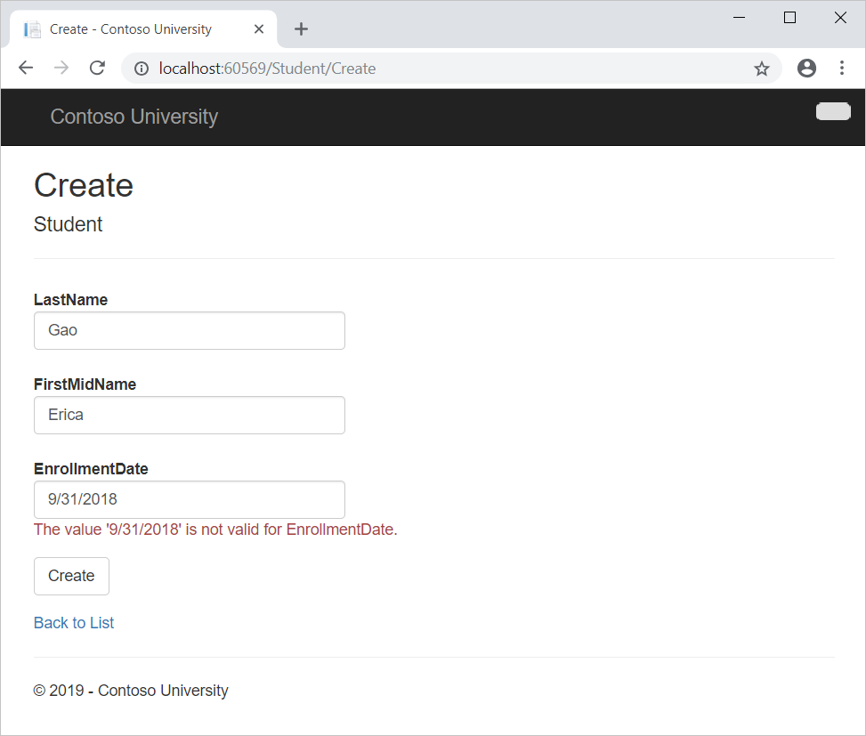
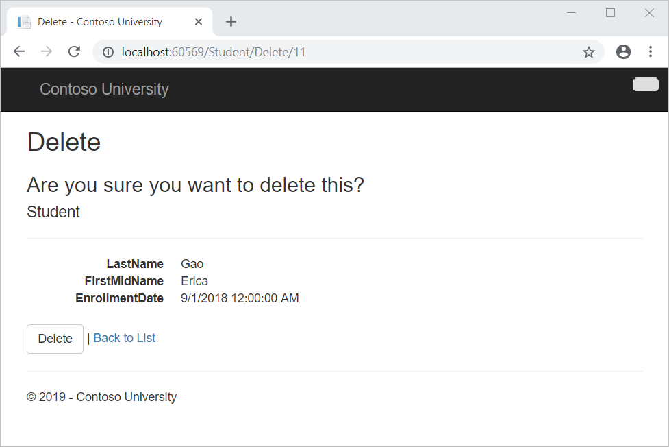

# پیاده سازی عملیات CRUD با Entity Framework در ASP.NET MVC  

در این آموزش، کدهای CREATE ، READ ،UPDATE ، DELTE (CRUD) را که MVC scaffolding به طور خودکار در کنترلرها و viewها ایجاد می کند، بررسی و سفارشی می کنیم.


 اینجا نمونه هایی از صفحات وب که ایجاد می کنید آورده شده است:







**در این آموزش موارد زیر را انجام خواهیم داد:**

 - یک صفحه Detail ایجاد می کنیم
 - صفحه Create را آپدیت می کنیم
 - متد HttpPost editing را آپدیت می کنیم
 - صفحه حذف را آپدیت می کنیم
 - اتصالات پایگاه داده را می بندیم
 - هندل تراکنش ها


## ایجاد صفحه Details 
کد scaffolded برای صفحه Students `Index` ویژگی `Enrollments` را کنار گذاشته است، زیرا این ویژگی دارای collection است. در صفحه `Details،` محتویات collection را در یک جدول HTML نمایش می دهید.

در Controllers\StudentController.cs، متد اکشن برای ویو  `Details ` از متد Find برای یافتن یک موجودیت `Student` استفاده می کند.

```C#

public ActionResult Details(int? id)
{
    if (id == null)
    {
        return new HttpStatusCodeResult(HttpStatusCode.BadRequest);
    }
    Student student = db.Students.Find(id);
    if (student == null)
    {
        return HttpNotFound();
    }
    return View(student);
}
```

مقدار کلید به عنوان پارامتر id به متد ارسال می شود و از route data در لینک Details در صفحه Index می آید.


**نکته: Route data**
<p dir="rtl">
Route data داده‌ای است که model binder در بخش URL مشخص شده در جدول  routing یافت می‌شود. به عنوان مثال، default route بخش های controller، action و id را مشخص می کند:
نکته: Route_data
Route_data داده‌ای است که model_binder در بخش URL مشخص شده در جدول _routing یافت می‌شود. به عنوان مثال، default_route بخش های _controller، _action و _id را مشخص می کند:
</p>


```C#

routes.MapRoute(
    name: "Default",
    url: "{controller}/{action}/{id}",
    defaults: new { controller = "Home", action = "Index", id = UrlParameter.Optional }
);
```

**Example:**
`http://localhost:1230/Instructor/Index/1?courseID=2021`

رشته `?courseID=2021` یک مقدار query string است. اگر `id` را به عنوان مقدار query string ارسال کنید، model binder نیز کار خواهد کرد:

ادرس های URL توسط عبارات ActionLink در Razor view ایجاد می شوند. در کد زیر، پارامتر id با default route مطابقت دارد، بنابراین id به route data اضافه می شود.

```C#

@Html.ActionLink("Select", "Index", new { id = item.PersonID  })
```
یا 

```html

<a href="/Select/Index/@item.PersonID">Select</a>
```

در کد زیر، courseID با پارامتری در default route مطابقت ندارد، بنابراین به عنوان query string اضافه می‌شود.

```C#

@Html.ActionLink("Select", "Index", new { courseID = item.CourseID })
```
یا

```html

<a href="/Select/Index/?courseID=@item.CourseID">Select</a>
```

## برای ایجاد صفحه Details

1. فایل Views\Student\Details.cshtml را باز کنید.

همانطور که در مثال زیر نشان داده شده است، هر فیلد با استفاده از یک `DisplayFor` Helper نمایش داده می شود:

```C#

<dt>
    @Html.DisplayNameFor(model => model.LastName)
</dt>
<dd>
    @Html.DisplayFor(model => model.LastName)
</dd>
```

2. پس از قسمت `EnrollmentDate `و بلافاصله قبل از بسته شدن تگ `</dl>`، کدی که در زیر نشان داده شده است را اضافه کنید تا لیستی از ثبت نام ها نمایش داده شود

```C#
<dt>
            @Html.DisplayNameFor(model => model.EnrollmentDate)
        </dt>

        <dd>
            @Html.DisplayFor(model => model.EnrollmentDate)
        </dd>

        <dt>
            @Html.DisplayNameFor(model => model.Enrollments)
        </dt>
        <dd>
            <table class="table">
                <tr>
                    <th>Course Title</th>
                    <th>Grade</th>
                </tr>
                @foreach (var item in Model.Enrollments)
                {
                    <tr>
                        <td>
                            @Html.DisplayFor(modelItem => item.Course.Title)
                        </td>
                        <td>
                            @Html.DisplayFor(modelItem => item.Grade)
                        </td>
                    </tr>
                }
            </table>
        </dd>

    </dl>
</div>
<p>
    @Html.ActionLink("Edit", "Edit", new { id = Model.ID }) |
    @Html.ActionLink("Back to List", "Index")
</p>
```

اگر پس از کپی کردن کد، code indentation اشتباه است، Ctrl+K، Ctrl+D را فشار دهید تا آن را فرمت کند.

3. صفحه Details را با starting program (Ctrl+F5) باز کنید، تب Students را انتخاب کنید و سپس روی پیوند Details برای Alexander Carson کلیک کنید. (اگر Ctrl+F5 را فشار دهید در حالی که فایل Details.cshtml باز است، با خطای HTTP 400 مواجه خواهید شد. این به این دلیل است که ویژوال استودیو سعی می کند صفحه جزئیات را اجرا کند، اما از پیوندی که دانش آموز برای نمایش مشخص شده است دسترسی پیدا نکرده است. اگر این اتفاق افتاد، «Student/Details» را از URL حذف کنید و دوباره امتحان کنید، یا مرورگر را ببندید، روی پروژه کلیک راست کرده و روی View > View in Browser کلیک کنید.)

لیست دروس و نمرات دانش آموزان منتخب را مشاهده می کنید.

4. مرورگر را ببندید.


## آپدیت صفحه Create 


## آپدیت متد HttpPost Edit


## آپدیت صفحه Delete 


## بستن کانکشن دیتابیس

برای بستن اتصالات پایگاه داده و آزاد کردن منابعی که در اختیار دارند در اسرع وقت، پس از اتمام کار context instance را از بین ببرید.
به همین دلیل است که کد scaffolded یک متد Dispose را در انتهای کلاس `StudentController` در StudentController.cs ارائه می دهد، همانطور که در مثال زیر نشان داده شده است:

```C#

protected override void Dispose(bool disposing)
{
    if (disposing)
    {
        db.Dispose();
    }
    base.Dispose(disposing);
}
```

کلاس base `Controller` از قبل رابط `IDisposable` را پیاده‌سازی می‌کند، بنابراین این کد به سادگی یک override به متد `Dispose(bool)` اضافه می کند تا حتما آن را از Context instance حذف کند.


## هندل کردن تراکنشش ها

به طور پیش فرض Entity Framework به طور ضمنی تراکنش ها را پیاده سازی می کند. در سناریوهایی که در چندین ردیف یا جدول تغییراتی ایجاد می‌کنید و سپس `SaveChanges` را فراخوانی می‌کنید، Entity Framework به‌طور خودکار مطمئن می‌شود که یا همه تغییرات شما موفقیت‌آمیز هستند یا همه ناموفق هستند.
اگر ابتدا برخی تغییرات انجام شود و سپس خطایی رخ دهد، آن تغییرات به طور خودکار برگردانده می شوند.


اکنون مجموعه کاملی از صفحات دارید که عملیات ساده CRUD را برای Student_entities انجام می دهند. شما از MVC _helpers برای تولید عناصر UI برای فیلدهای داده استفاده کردید.
